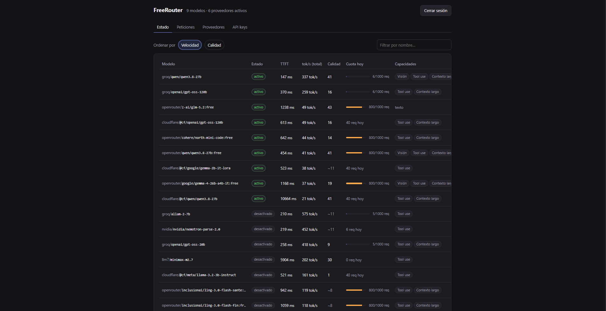
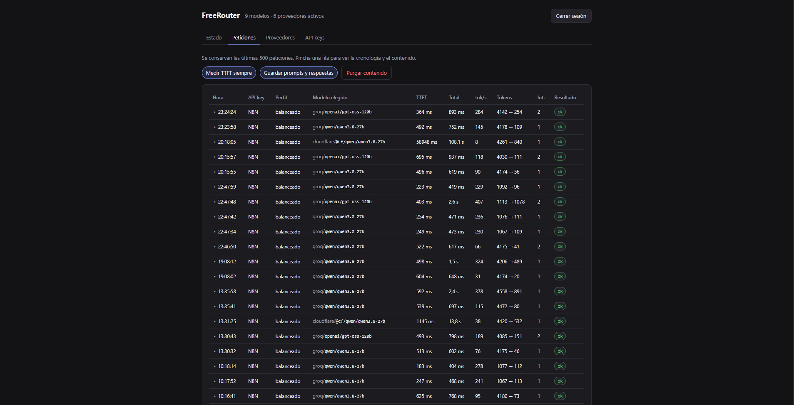
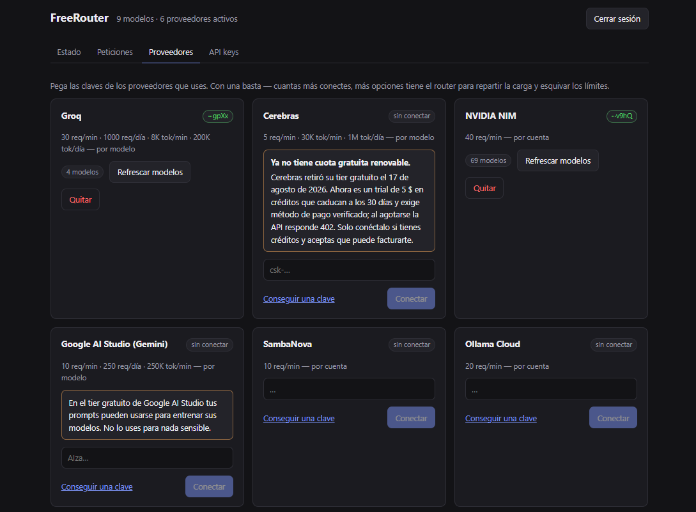
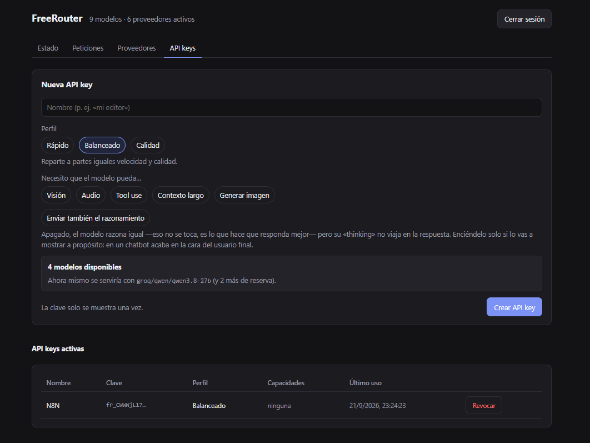

# FreeRouter

**English** · [Español](README.es.md)

**A single OpenAI-compatible endpoint in front of 24 free inference providers.** You bring
the keys; it decides which model serves each request, respects every provider's quota so
it never triggers a 429, and fails over when one of them breaks.

[](LICENSE)
[](https://nodejs.org/)
[](docker-compose.yml)
[](https://github.com/David-Raffo/FreeRouter/actions/workflows/ci.yml)

```python
from openai import OpenAI

client = OpenAI(base_url="http://localhost:8787/v1", api_key="fr_...")
client.chat.completions.create(model="auto", messages=[{"role": "user", "content": "Hello"}])
```

You enter your provider keys once, create an API key choosing **fast / balanced / quality**
plus the capabilities you need (vision, tool use…), and point any OpenAI-compatible client
at the local port.

From then on the client knows nothing: it does not pick a model, it does not know which
provider is answering, and it does not have to handle retries.

### The dashboard

> The dashboard UI is in Spanish.



Every model with its TTFT, its tok/s rate and its quality score — measured, not declared.
Models that cannot serve sink to the bottom, and a grey score (`~11`) flags that the
quality is a per-family estimate rather than an Intelligence Index value.



Which API key called, which model ended up serving it and how many attempts it took.
Clicking a row opens the timeline: who was tried, with which error and how long each
attempt took. This screenshot shows the router at work — the two requests with `Int. 2`
are failovers the client never noticed.



Paste the keys and you are done. Each card shows that provider's real limits and warns
about what you should know before connecting it: that Cerebras no longer has a free tier,
or that Google may use your prompts for training.



The client does not pick a model: you choose a profile and capabilities, and before the
key is created you are told how many models it would have and which one would serve it
right now.

### Why

Free inference providers are useful but fragile: each one has different per-minute and
per-day limits, they go down, change their catalogue and return 429 at the worst possible
moment. That forces every client application to know which provider to use, which model to
ask for and how to retry. FreeRouter turns this around: that logic lives in one place and
applications never have to care.

### Contents

- [Installation](#installation) · [Docker](#docker) · [Password](#password)
- [Usage](#usage) · [Endpoints](#endpoints)
- [How it decides](#how-it-decides) — quality, speed and why they are measured this way
- [Quotas](#quotas) · [Providers](#providers) · [What is actually free](#what-is-actually-free)
- [Configuration](#configuration) · [Security](#security) · [Exposing it to the internet](#exposing-it-to-the-internet)
- [Model list](#model-list) · [Request history](#request-history) · [Calibration](#calibration)
- [Known limitations](#known-limitations) · [Project structure](#project-structure) · [Tests](#tests)

## Installation

```bash
git clone https://github.com/David-Raffo/FreeRouter.git
cd FreeRouter
```

With Docker (recommended) skip to [Docker](#docker). To run it directly:

```bash
npm install
npm run build          # builds the dashboard and the server
npm start              # http://localhost:8787/app/
```

For development, `npm run dev` starts the server with hot reload; the dashboard has its
own `npm run dev --workspace=web` on port 5173, proxying to 8787.

## Docker

```bash
cp .env.example .env
# edit .env and set FREEROUTER_PASSWORD

docker compose up -d --build
# dashboard: http://localhost:8787/app/
docker compose logs -f          # watch routing live
```

That is all: open the dashboard, connect the provider keys you have and create your first
API key.

**A single port**, `8787`, serves both the dashboard and the API. It is safe to publish
because both are authenticated: the dashboard with the password from `.env` and `/v1`
with your FreeRouter API keys.

### Password

```
FREEROUTER_PASSWORD=whatever-you-like
```

**It will not start without one.** `docker compose up` fails explaining what is missing,
and if the variable exists but is too short, the server stops before opening the port.
There is no path that ends in an unprotected, reachable dashboard.

That is why the password is an environment variable rather than a setup wizard: on its own
a variable would be dangerous — forgetting it would leave the dashboard open — but if
forgetting it prevents startup, the mistake becomes impossible. It is the same deal
Postgres makes with `POSTGRES_PASSWORD`.

To change it, edit `.env` and run `docker compose up -d`. Open sessions are dropped
automatically: the current password is part of the cookie signature, so if you change it
because someone else knew it, their session stops working with nothing else to do.

If you only use it on your own machine and do not want a password,
`FREEROUTER_DISABLE_AUTH=true`.

The database, the master key and the encrypted keys live in the `freerouter-data` volume,
so they survive `docker compose down` (to delete them: `docker compose down -v`).

`server/catalog/` is mounted from the repository, so you can tweak the limits in
`limits.json` and restart the container without rebuilding the image.

Optional variables, via `.env` next to `docker-compose.yml`:

```
ARTIFICIAL_ANALYSIS_API_KEY=aa_...
FREEROUTER_PASSPHRASE=...
```

To use it from outside the machine, see [Exposing it to the internet](#exposing-it-to-the-internet).

## Usage

```python
from openai import OpenAI

client = OpenAI(base_url="http://localhost:8787/v1", api_key="fr_...")

response = client.chat.completions.create(
    model="auto",                       # ignored: the router chooses
    messages=[{"role": "user", "content": "Hello"}],
)
```

The response carries three headers: `x-freerouter-model` with the model that ended up
serving the request, `x-freerouter-attempts` with how many attempts it took, and
`x-freerouter-router-ms` with how long FreeRouter took to decide — around 4 ms, so you can
check for yourself that the time is spent by the provider and not by the router.

### Reasoning

Reasoning models leak their "thinking" in two ways: between `<think>…</think>` tags inside
the text itself, or in a separate field (`reasoning_content` in DeepSeek, `reasoning` in
OpenRouter). In a chatbot, that ends up in front of the end user.

By default **it is not forwarded**. The model still reasons — that is untouched, it is what
makes it answer better; the only thing that changes is what travels in the response. Each
API key has a "Also send reasoning" checkbox in case you want to show it on purpose.

Filtering it while streaming is trickier than it looks: the tag arrives split across chunks
("`<thi`" and "`nk>`"), so the filter remembers anything that could still be the start of
one. It only holds text back when the tail really looks like a tag: always holding a few
characters "just in case" would delay normal text, and in streaming that is noticeable.

### Endpoints

| Endpoint | Purpose |
| --- | --- |
| `POST /v1/chat/completions` | The classic OpenAI API. Streaming and non-streaming |
| `POST /v1/responses` | The newer API. Translated internally to the classic one |
| `GET /v1/models` | Returns a single pseudo-model, `auto` |

Both are supported because clients are split: the OpenAI SDK uses `chat.completions` by
default, n8n ships with *Use Responses API* enabled, and LangChain enables it depending on
configuration. Whichever you use, routing is the same.

What a free-model router cannot provide is left out of `/v1/responses`: built-in tools
(web search, code interpreter) are executed by OpenAI on its own infrastructure and are
discarded here, and `previous_response_id` is rejected with a clear error because
FreeRouter does not store conversations — send the full history in `input`, as with the
classic API.

`GET /v1/models` returning only `auto` is intentional: the client does not choose a model,
that is the whole point of the project. If your tool forces you to pick one from a list,
pick `auto`; if it lets you type it, anything works.

## How it decides

```
candidates = models that meet the required capabilities
           ∩ with enough context
           ∩ with quota available
           ∩ not quarantined

score = (quality_weight · quality + speed_weight · speed) · quality_penalty
```

Both components are measured on an **absolute scale**, not relative to the other
candidates. Normalising against the group — 1 for the best, 0 for the worst — had two
flaws: in a group of slow models one of them still scored 1 on speed, and the fastest got
the maximum even when its advantage was imperceptible.

| Profile      | Quality | Speed |
| ------------ | ------- | ----- |
| `rapido`     | 0.15    | 0.85  |
| `balanceado` | 0.50    | 0.50  |
| `calidad`    | 0.85    | 0.15  |

- **Speed**: combines two measurements, with throughput weighing almost twice as much as
  start-up, and **saturates at 200 tok/s**. At that rate a hundred-token answer is out in
  half a second; a model running at 667 does not make it noticeably better. Without that
  ceiling, raw speed bought first place: a quality-11 model running at 667 tok/s ranked
  ahead of far more capable ones. TTFT has its own absolute bounds, 300 ms (anything below
  feels the same) and 10 s.
- **Quality floor**: below an Intelligence Index of **15** the score drops quadratically —
  an 11 keeps half, a 1 keeps a thousandth. It is not a filter: the model stays in the
  chain as a last resort, because a weak model is better than none, but it stops competing
  for first place. It is needed because the median quality of the free tier is 11: without
  a floor, the router ends up on useless models as soon as the good one runs out of quota.

  | Metric | Weight | Why |
  | ------ | ------ | --- |
  | End-to-end tok/s | 0.65 | Once the answer is longer than a couple of sentences, throughput dominates the wait |
  | TTFT    | 0.35 | Dominates short answers and autocompletion |

  At startup every model is calibrated with the same medium-sized prompt (~100-word
  answer), and from then on measurements are refreshed with real traffic plus an
  occasional probe of models that have not been used for a while.

  **Why "end to end" and not stream rate.** Counting tokens over the streaming interval
  (total − TTFT) looks more precise, but it does not work: several providers behind
  OpenRouter's proxy generate the whole answer server-side and release it at once. In
  those cases the streaming interval measures the *download*, not generation. Measured
  with the diagnostic endpoint:

  | Model | burst events (<1 ms) | stream rate | end to end |
  | ----- | -------------------- | ----------- | ---------- |
  | `ling-3.0-flash-fin:free`      | 74 % | 415 tok/s | 116 tok/s |
  | `lfm-2.5-2.6b:free`            | 63 % | 304 tok/s | 148 tok/s |
  | `nemotron-3-super-120b:free`   |  0 % |  66 tok/s |  53 tok/s |

  The only one that truly streams token by token (0 % burst) is the only one whose two
  figures agree. Over total time it does not matter where each provider buffers, and it is
  also what determines how long you actually wait.

  `POST /api/models/<id>/measure` with `{"providerId":"…"}` returns the full detail of a
  measurement — events, gaps between them, burst ratio — so any figure that looks off can
  be audited. When the provider reports its own generation time (Groq sends
  `usage.completion_time`) it is returned too, as the only external reference to check
  against:

  | Model (Groq) | Measured end to end | According to Groq |
  | ------------ | ------------------- | ----------------- |
  | `allam-2-7b`        | 606 tok/s | 1410 tok/s |
  | `openai/gpt-oss-20b`| 519 tok/s |  919 tok/s |
  | `qwen/qwen3.8-27b`  | 413 tok/s |  510 tok/s |

  Our figures are systematically more conservative because they include the network round
  trip and TTFT. Groq really is that fast.
- **Quality**: Intelligence Index from [Artificial Analysis](https://artificialanalysis.ai/).
  The repository already ships with the known models measured, so the `calidad` profile
  works with no configuration. With a free key in `ARTIFICIAL_ANALYSIS_API_KEY`, ~630
  models are synced and coverage goes up a lot: the dashboard distinguishes a measured
  value (`52`) from a per-family estimate (`~24` in grey).

  Endpoint details that took effort to find: the index is nested in
  `evaluations.artificial_analysis_intelligence_index`, not at the model root, and the
  response is paginated — stopping at the first page leaves out two thirds of the data.
  Syncing **merges**: it never deletes a value already present in `quality.json`.

Required capabilities do not come only from the API key: if the request includes an image
or defines tools, they are required even if the key did not declare them.

## Quotas

This is the reason the project exists. A model without quota **is not considered for
selection**, so the 429 is avoided before it happens instead of reacting to it.

| Provider   | Limits (seed)                           | Scope       | Runtime correction           |
| ---------- | --------------------------------------- | ----------- | ---------------------------- |
| Groq       | 30 req/min · 1,000 req/day · 8K tok/min | per model   | `x-ratelimit-*` headers      |
| Cerebras   | 5 req/min · 30K tok/min · 1M tok/day    | per model   | local counters               |
| OpenRouter | 20 req/min · 50 or 1,000 req/day        | per account | `GET /api/v1/key` on validation |

### When a 429 arrives anyway

The model is benched with a penalty that **grows on repetition**: one minute the first
time, doubling every time it comes back and hits it again, up to a six-hour cap. A
successful request resets it to the minimum.

A fixed penalty does not work, because a 429 hides two different situations and does not
say which one it is:

- A momentary spike. OpenRouter's `:free` models run on shared providers and at peak hours
  return 429 with "Provider returned error" — not OpenRouter's quota, but the upstream
  provider being saturated. They are back within a minute.
- A genuinely exhausted bucket, which will stay exhausted for a good while.

With a short penalty, the second case is retried endlessly. And retrying is not free:
measured on real traffic, a Groq failure costs 76 ms median but an OpenRouter one costs
532 ms, seven times more — and on OpenRouter it also burns one of the 50 daily requests,
because there **failed requests count too**. With a long penalty, on the other hand, a
one-minute spike leaves you without your best model for hours. Doubling starts cheap and
only gets expensive for whoever proves it should be.

**The penalty is multiplied where mistakes are expensive, or where we are flying blind.**
Each provider has its own `rateLimitPenaltyFactor` in `providers.json`, and there are two
reasons to raise it:

- **Retrying is expensive.** OpenRouter is at 4: a failure there takes seven times longer
  than one on Groq and also burns one of the 50 daily requests.
- **We do not know the limit.** Seven providers do not publish it (SambaNova, OpenCode,
  OVH, Z.AI, LLM7, Ollama) or have one that does not fit this catalogue (ModelScope's
  per-model cap). There the preventive quota is a guess and the 429 is the only real
  signal: reaching it already means the estimate failed, so they are at 2. Groq does not
  need it, because it publishes its quota in headers and the 429 is avoided up front.

It is a catalogue value, not code: if a provider publishes its limits tomorrow, it is
lowered there and routing does not notice.

| Consecutive 429s | Groq (×1) | OpenRouter (×4) |
| --- | --- | --- |
| 1st | 1 min | 4 min |
| 2nd | 2 min | 8 min |
| 3rd | 4 min | 16 min |
| 4th | 8 min | 32 min |
| 6th | 32 min | 2.1 h |
| 8th | 2.1 h | 6 h (cap) |

Two limits on the penalty: if the provider sends `retry-after`, it knows better than we
do and its figure wins — the multiplier is not applied; and a model is never benched past
the daily reset, because after that the quota comes back by itself.

### Providers

The catalogue lives in `server/catalog/providers.json`. Since all of them expose an
OpenAI-compatible API, a provider is **data, not code**: base URL, key format and limits.
Adding one is an entry in that JSON. The only two with custom logic — Groq, which reports
its quota in headers, and OpenRouter, which has an account endpoint — provide it in
`src/providers/overrides.ts`.

| Provider | Free quota | Notes |
| -------- | ---------- | ----- |
| **Groq** | 30 req/min · 1,000 req/day, renewing | The only one that publishes its quota in headers |
| **NVIDIA NIM** | ~40 req/min, no card | Large catalogue for prototyping |
| **Google AI Studio** | 10-15 req/min, varies by model | ⚠️ Your prompts may be used for training |
| **SambaNova** | Small developer quota | Limits not published |
| **Ollama Cloud** | Per-session and weekly limits | Not published |
| **Cloudflare Workers AI** | 10,000 neurons/day, resets at 00:00 UTC | Two-part credential: `accountId:token` |
| **Mistral** | Free Experiment plan | Includes Codestral with the same key |
| **OVHcloud** | 2 req/min without a key, more with one | |
| **Z.AI** | Flash models only | The rest is billed |
| **SiliconFlow** | Zero-priced models | SMS sign-up |
| **LLM7** | Shared tier, **no key** | Connect with the field empty |
| **OpenCode Zen** | A few free models | ⚠️ Some may use your data for training |
| **Requesty** | ~200 req/day | Only its zero-priced models are routed |
| **OpenRouter** | 50 req/day (1,000 after spending $10) | Failures also consume quota |
| **ModelScope** | 2,000 req/day per account, resets every 24 h | More daily quota than Groq. Chinese platform: higher latency from Europe |
| **OrcaRouter** | Rate-limited, not quota-limited; no card | 3 free models + an alias that load-balances across them |
| **TokenRouter** | 2 zero-priced models | No published limits; they warn themselves that stability is not guaranteed |
| **Pollinations** | 12 req/min with free sign-up | 280 text models out of 394; the rest are image and audio |
| **Cohere** | 1,000 calls/month · 20 req/min | Trial keys: evaluation, not production |
| **Hugging Face** | $0.10/month renewing credit | Not much; sits near the end of the chain |
| **Cerebras** | ⚠️ No longer free | $5 trial that expires |
| **Scaleway** | ⚠️ 1M welcome tokens | Credit that runs out |
| **Alibaba DashScope** | ⚠️ 1M tokens/model, 90 days | Expiring credit |
| **Novita** | ⚠️ No stable zero-priced models | Included in case some appear |

Providers marked ⚠️ **have no renewing quota**: they are credits that run out and then
bill. The dashboard warns about it on their card before you connect the key.

**The last three were verified on 2026-09-06** by calling their APIs, not by reading
lists. It is worth recording what was discarded, because almost everything circulating as
a "free API" is not:

- **GitHub Models has been retired** since 30 July 2026, and curated lists of "permanently
  free APIs" were still recommending it.
- **DeepSeek, Fireworks and Together** give one-off welcome credit, not a renewing quota.
  That is the ⚠️ category and there are enough of those already.
- **Pollinations' anonymous tier no longer exists** in practice despite what its own docs
  say: the first request goes through and the following ones return 401. That is why it is
  listed here with a token, which is still free.
- **AI Horde** is genuinely free, but its API is asynchronous, proprietary and served by
  volunteer GPUs: it is not OpenAI-compatible and its latency is unpredictable, which is
  exactly what poisons a router that scores by speed.
- **DuckDuckGo AI Chat, Cloudflare AI Playground, UncloseAI and similar** are consumer app
  endpoints obtained by reverse engineering, not offered APIs. The same goes for proxying
  GitHub Copilot or Codex, which are subscription products. They are not included: they
  break without warning and using them goes against the terms of whoever pays for them.

What was checked for each one on 2026-09-04: that the URL responds and that model listing
works. Exact limits change often and several providers do not publish them, so
`defaultLimits` is only a conservative seed, corrected at runtime by the provider's own
headers and 429s.

**Two-part credentials.** Cloudflare puts the account id inside the URL
(`/accounts/{id}/ai/v1`), so its credential is pasted as `accountId:token` and split on
the first `:` — the token may contain more. The descriptor declares it with
`credentialFormat: "account:token"` and `baseUrlTemplate`; the rest of the router does not
notice. Cloudflare also does not expose `/models` on its OpenAI-compatible path (it
returns 405): its models are listed separately, at `/ai/models/search`, filtering by the
"Text Generation" task.

**How unusable models are filtered out.** A large catalogue contains everything, and
routing a chat to an embeddings model or an image generator always fails:

- `freeOnly` for aggregators that mix free and paid models (OpenRouter, Requesty,
  SiliconFlow): only confirmed zero-priced models pass. A model with unknown pricing is
  discarded — better to lose a model than to be billed by accident.
- `freeIdPattern` when the aggregator mixes free and paid models but **does not publish
  readable prices**. OrcaRouter returns 194 models with no price field, Claude Opus and
  GPT among them; TokenRouter does not even allow listing without a key. In both, the only
  thing that distinguishes free models is the id suffix (`-free`, `:free`), so only those
  pass. With no price to check, the id is the only defence against accidental billing: on
  OrcaRouter it leaves 4 of the 194 models.
- `model_type` when the provider declares it. LLM7 publishes 46 models: 37 chat, 6 video
  and 3 image. Only the 37 get in.
- Name patterns for embeddings, TTS, transcription and classifiers.
- **models.dev** when the provider's listing is not enough. OpenCode Zen serves 70 models
  and its `/models` returns only the id: without pricing there is no way to know which are
  free, and paid Claude, GPT and Gemini are in there. models.dev is the open catalogue
  OpenCode itself uses and publishes price, context, modalities and tool use per model;
  crossing it with what the provider actually serves leaves the 8 free ones.

  It is enabled with `modelsDevKey` in the descriptor, and **only where its prices reflect
  the free tier**. For providers that charge by usage (Cloudflare and its neurons)
  models.dev publishes paid rates, so filtering by them would empty the catalogue. The
  provider's listing always takes precedence over models.dev.

### What is actually free

- **Groq** and **OpenRouter** have a free quota that renews by itself. On OpenRouter only
  models with the `:free` suffix are routed (price 0 confirmed by its API).
- **Cerebras no longer is.** It retired its free tier on 17 August 2026: it is now a $5
  trial in credits that expire after 30 days and requires a verified payment method. Once
  exhausted it returns `402`. The dashboard warns about it on its card before you connect
  the key, and if it answers 402 the account is marked unusable and traffic continues
  through the others. **Only connect it if you accept it may bill you.**

The values in `server/catalog/limits.json` are only the seed: provider headers take
precedence. Daily counters are persisted in SQLite, so restarting does not give back
quota already spent.

**OpenRouter is deliberately at the end of the failover chain**: its daily quota is 50
requests (1,000 if the account has accumulated $10 of lifetime credit) and failed requests
consume it too.

## Configuration

| Variable                       | Default               | Purpose                                               |
| ------------------------------ | --------------------- | ----------------------------------------------------- |
| `FREEROUTER_PASSWORD`          | —                     | **Required.** Dashboard password; it will not start without it |
| `FREEROUTER_DISABLE_AUTH`      | `false`               | Removes the password. Local use only                  |
| `FREEROUTER_HTTPS`             | `false`               | Marks the session cookie as `secure`                  |
| `FREEROUTER_PORT`              | `8787`                | Dashboard and API port                                |
| `FREEROUTER_HOST`              | `127.0.0.1`           | Listening interface                                   |
| `FREEROUTER_HOME`              | `~/.freerouter`       | Database and master key                               |
| `FREEROUTER_PASSPHRASE`        | —                     | Derives the master key from a passphrase (scrypt)     |
| `ARTIFICIAL_ANALYSIS_API_KEY`  | —                     | Enables the real Intelligence Index                   |
| `FREEROUTER_DB`                | `<HOME>/freerouter.db`| SQLite file path                                      |
| `LOG_LEVEL`                    | `info`                | Log verbosity (`debug`, `warn`, `error`…)             |
| `FREEROUTER_BIND`              | `0.0.0.0`             | Interface 8787 is published on (Docker only)          |
| `FREEROUTER_DOMAIN`            | —                     | Domain for the `https` profile (Caddy)                |
| `ACME_EMAIL`                   | —                     | Let's Encrypt notification email, `https` profile     |
| `CLOUDFLARE_TUNNEL_TOKEN`      | —                     | Tunnel token, `tunnel` profile                        |

The files in `server/catalog/` (`limits.json`, `capabilities.json`, `quality.json`) can be
edited by hand and are reloaded without recompiling.

## Security

Three layers, designed so that installing it on a server is safe with no configuration.

**1. Mandatory password** in `FREEROUTER_PASSWORD`, without which it will not start (see
above). By the time the port opens, the password already exists: there is no window in
which someone could claim the instance, a risk n8n documents in its own setup wizard.

The session lives in an HMAC-signed, `httpOnly`, `SameSite=Lax` cookie, with no session
table. Eight failed attempts lock access for five minutes.

**2. Encryption at rest.** Provider keys are encrypted with AES-256-GCM; the master key
lives in `~/.freerouter/master.key` with restricted permissions (and its own ACL on
Windows). The dashboard only ever sees the last 4 characters of each key.

### Exposing it to the internet

The login is enough for a local network. To publish it on the internet you need
**HTTPS**, and the application does not solve that: without it, the session cookie and
your API keys travel in clear text.

There are two ways, depending on whether your server has a public IP. Both are Docker
Compose profiles in this same repository: no extra files and no manual steps.

**Method 1 — open the port (`--profile https`).** The usual choice for a VPS: you have a
public IP and can point a domain at it. Caddy sits in front and obtains the Let's Encrypt
certificate by itself, with no account anywhere.

```
# .env
FREEROUTER_PASSWORD=whatever-you-like
FREEROUTER_DOMAIN=freerouter.yourdomain.com
ACME_EMAIL=you@example.com        # expiry notices; optional but recommended
FREEROUTER_HTTPS=true
FREEROUTER_BIND=127.0.0.1         # 8787 is no longer reachable from outside
```

```bash
# the domain must already resolve to the server IP, with ports 80 and 443 open
docker compose --profile https up -d
# dashboard: https://freerouter.yourdomain.com/app/
```

`FREEROUTER_BIND=127.0.0.1` is what prevents bypassing HTTPS by going straight to `:8787`.
The certificate renews itself; there is no cron job to set up.

**Method 2 — Cloudflare tunnel (`--profile tunnel`).** For when you *cannot* open ports: a
home server, behind CGNAT, or a router you do not control. The connection goes from the
inside out, so there is nothing to open — in exchange you need a (free) Cloudflare account
and traffic goes through them.

In [Cloudflare Zero Trust](https://one.dash.cloudflare.com/) → Networks → Tunnels, create
a tunnel, copy the token and point the *public hostname* at `http://freerouter:8787`.

```
# .env
FREEROUTER_PASSWORD=whatever-you-like
CLOUDFLARE_TUNNEL_TOKEN=eyJ...
FREEROUTER_HTTPS=true
FREEROUTER_BIND=127.0.0.1
```

```bash
docker compose --profile tunnel up -d
```

**Which one to choose.** If you have a public IP and a domain, method 1: fewer moving
parts, no dependency on anyone, and nobody else sees your traffic. Method 2 is the answer
when opening a port is not an option, not an improvement over method 1.

**For a quick test only**, with no domain or accounts, an ephemeral tunnel against the
running container is enough:

```bash
docker run --rm --network host cloudflare/cloudflared:latest tunnel --url http://localhost:8787
```

It gives you a `https://something-random.trycloudflare.com` URL that dies when you stop the
process. Good for testing from your phone or elsewhere; not for leaving it running.

`FREEROUTER_DISABLE_AUTH=true` removes the password. It only makes sense if the dashboard
is bound to `127.0.0.1` and nobody else can reach that machine.

## Behaviour with broken providers

Learned from real traffic, not in theory:

- **402 Payment Required** (Cerebras trial exhausted): it is an account problem, so the key
  is marked invalid with the reason visible in the dashboard and traffic continues through
  the others. It is not retried, because retrying does not fix it.
- **401 on a specific model**: some OpenRouter models are reserved for certain customers
  and answer 401 even though the key is valid. Before declaring the key dead it is
  revalidated; if it is fine, **only that model** is disabled. Without this check one odd
  model would take down the provider's other 17.
- **A model that does not generate a single token** — the first-token deadline expires, or
  it returns 200 and writes nothing — is removed from routing **on the first failure** and
  retired on the third. It is not a blip: the provider advertises it and it does not work,
  and NVIDIA alone publishes dozens like that. With normal treatment it took eight
  failures and, between quarantines, that meant hours during which the model still showed
  as active and could receive real traffic.
- **An isolated 5xx keeps its margin**: three failures for quarantine and eight to retire
  it. There an isolated failure really is usually transient, and retiring on it would lose
  models that work.
- **Continuing the chain**: *any* error moves on to the next candidate, a 400 included. In
  theory a 400 is the request's fault and would fail the same everywhere; in practice it
  is not — OpenCode returns 400 with "Upstream request failed: Model is unavailable", which
  is its own problem in disguise. If every candidate agrees on rejecting it, then a 400
  with the reason is returned instead of a generic 502.
- **A provider that does not support streaming** does not get a failure for it. Measuring
  TTFT is our own extra (see [Always measuring TTFT](#always-measuring-ttft)): if it
  rejects it, the same model is retried without chunking and it is recorded so it is never
  asked again. It does not count as a failed attempt and does not affect its health.

Automatically disabled models can be re-enabled from the dashboard.

## Known limitations

- **Image generation**: the capability exists in the data model and the filter works, but
  today no free model from the supported providers generates images. When that checkbox
  is ticked the dashboard warns that the key would have no candidates, instead of letting
  it fail later with a 503.
- **Intelligence Index coverage**: only some of the free models are evaluated by
  Artificial Analysis (the free tier leans towards small, freshly released models, which
  are the least evaluated). The rest use a per-family estimate, shown as `~N` in grey in
  the dashboard. A free Artificial Analysis key widens coverage.
- **Context on Cerebras**: it does not publish the window size in its API. The value from
  `capabilities.json` is used and only corrected downwards when a model rejects a request
  for exceeding its context.
- **Models with visible reasoning**: some return `<think>` blocks inside `content`, and
  others send it in a separate field (`reasoning_content`, `reasoning`). By default **it is
  not forwarded to the client**: see [Reasoning](#reasoning).
- **Failover while streaming**: only possible before the first token is emitted. If a
  provider fails mid-stream, the error is propagated to the client.

## Model list

Sorted and paginated **on the server**, not in the browser. With a catalogue of thousands
of models, sending the whole list on every dashboard refresh would mean megabytes every
few seconds.

The order is always the same, on two levels: first by status and then by the metric you
choose (speed or quality). Models that cannot serve sink to the bottom, ordered by how
severe the problem is:

| Status | Meaning |
| ------ | ------- |
| `active` | Routable right now |
| `cooldown` | Waiting after a 429 |
| `no_quota` | Daily quota exhausted |
| `quarantined` | Out due to consecutive failures |
| `disabled` | Turned off manually or rejected by the provider |
| `provider_down` | The provider account cannot serve |

Status is computed on the server, not in the dashboard, so the list order and what is
shown on screen can never disagree. An unmeasured model ranks behind measured ones but
ahead of broken ones: it can still serve, it is just not yet known how well.

`GET /api/models?sort=speed|quality&page=1&pageSize=25&q=filter`

## Request history

The dashboard's **Requests** tab lists the last 500 calls: which API key made it, which
model ended up serving it, TTFT, tok/s for that specific request, tokens and attempts.
Clicking a row expands the timeline, the prompt and the response.

The table shows TTFT and **total time** separately, which are not the same: if the answer
arrived in one piece there is no first token to time and TTFT is left blank (see
[Always measuring TTFT](#always-measuring-ttft)).

The **timeline** is what explains a TTFT that does not add up: it records which model was
tried, in which order, with which error and **how long each attempt took**, plus the
router's own overhead.

```
Attempts                              1.4 s lost before succeeding
 1  [rate_limit]  groq/llama-3.3-70b        820 ms
 2  [auth]        cerebras/qwen-3-32b       580 ms
 3  [ok]          nvidia/deepseek-v4-flash  TTFT 420 ms · 2.1 s
```

Without this, a request with a 420 ms TTFT that reached the client in almost two seconds
looks like a contradiction. Time lost on failed candidates does not show up in any other
metric. Only the one that answered has a TTFT: the others never emitted anything, so
putting a number there would be making it up. The timeline is metrics, not content, so it
is kept even when prompt logging is turned off.

### Always measuring TTFT

An answer that arrives in one piece has no "first token", so there is no TTFT to time.
That leaves out every client that does not use streaming — n8n, for one — and the router
loses one of its two speed metrics no matter how much it is used.

That is why, by default, **FreeRouter asks the provider for a chunked response even if
your client did not**, times the first token and reassembles it before answering. What you
receive is a `chat.completion` identical to the one you would have received anyway; the
only difference is that there is now a TTFT.

It can be turned off with the "Always measure TTFT" checkbox in the Requests tab.

It costs no time. Measured over 24 requests alternating both modes against the same model,
for a clean comparison:

| | ms per token | spread (p25-p75) |
| --- | --- | --- |
| With internal streaming | 2.73 | 0.09 |
| In one piece | 2.73 | 0.19 |

It is the same work for the model; only the transport packaging changes.

**And it can never cause an error**, because measuring TTFT is an extra and must not cost
a single request. The cases:

- The provider **ignores** the chunking request and answers in one piece. It is read as
  is; only the TTFT is lost, which did not exist there anyway.
- The provider **rejects** it with a 400. The same model is retried without chunking — it
  does not move to another one — and it is recorded so it is never asked again. That
  rejection does not count as a failure and does not affect the model's health. Only a 400
  triggers this: a 5xx says nothing about streaming, and retrying it would double the
  calls to a provider that is already failing.
- The provider answers 200 with an unusable stream. Same: retry in one piece and record it.
- If the stream carries no `usage`, tokens are estimated by length instead of being lost:
  otherwise they would not be deducted from the daily quota and there would be no tok/s.

The prompt is stored **split by message**, not as a single block of text, and the
dashboard only expands **the last exchange**: the assistant's last answer and what the
user replied to it, with the question highlighted. Everything else starts collapsed — the
system prompt on one side, the earlier conversation in a single block — and is one click
away. A chatbot request carries the whole conversation, and with twenty turns in front you
had to scroll half a screen to find what you actually wanted to see. If the last exchange
contains tool results, they stay visible: they are part of it.

Space is allocated **from the end**, and that fixes more than presentation: previously
everything was concatenated and cut at 4,000 characters from the start, so with a system
prompt longer than that **the user's message was never stored**. Now the last thing said
is kept whole and whatever is left over is taken from the system prompt, marked as
truncated. Requests from before this change are still shown as they were.

Storing prompts and responses is enabled by default — it is what makes the history useful —
but it is sensitive data kept in the local database. It can be turned off with the "Store
prompts and responses" checkbox, and "Purge content" deletes texts already stored while
keeping the metrics. Each text is capped at 4,000 characters and only the last 500
requests are kept, so the database does not grow unchecked.

## Calibration

At startup, FreeRouter measures **every** model with the same prompt (an answer of about a
hundred words) read as a stream, and stores TTFT and tok/s. Without that initial
measurement the router would rank almost purely by quality for quite a while, because a
model with no data sits in the middle of the speed scale: neither advantage nor penalty.

It triggers by itself at two moments: at startup and **when a provider is connected**. The
second matters more than it seems: periodic probing measures one model every two minutes,
so connecting a provider with dozens of models would take over an hour to have data, and
the router would decide almost blindly in the meantime. The dashboard only reports
progress; there is no button because there is no need to press it.

Calibration respects quota like any other request: if a provider's per-minute bucket fills
up, it **waits** for a slot instead of skipping the model. To re-measure everything from
scratch: `POST /api/warmup?force=true`.

**How often a model is re-measured.** It is not a fixed number, and it cannot be: a probe
spends a real request from the provider's quota. Measuring every model every hour costs
Cohere 72 % of its 33 daily requests and OpenRouter 48 % of its 50, while it costs NVIDIA
or Cloudflare — with no daily cap — nothing. A single threshold either ruins the poor or
wastes the rich.

So the rate comes from the quota: **5 %** of the provider's daily requests is reserved for
probes and split among its models.

| Provider | Models | Quota/day | Re-measured every | Cost |
| --- | --- | --- | --- | --- |
| NVIDIA | 68 | no cap | 3 h | — |
| Groq | 7 | 1,000 | 3.4 h | 5 % |
| ModelScope | 47 | 2,000 | 11.3 h | 5 % |
| Google | 10 | 250 | 19.2 h | 5 % |
| OpenRouter | 18 | 50 | 172 h | 5 % |
| Cohere | 10 | 33 | 145 h | 5 % |

For a provider so tight that it ends up with a cooldown of days, that is exactly the right
answer: with 33 daily requests you do not spend them on measuring. It is measured once in
the initial calibration and from then on real traffic drives it, updating the same
metrics at no extra cost.

The three-hour base is not one hour either: a model's speed does not change from hour to
hour, the ones actually in use already refresh themselves, and there are providers with no
request cap that do have a cap on something else — Cloudflare counts neurons — for which
68 probes an hour would hurt.

**The loop sweeps, it does not drip.** Previously one model was measured every two minutes:
with 76 models and a 30-minute threshold that required 152 measurements per hour and only
30 were done, so the catalogue was never up to date. Now every minute it checks which
models have completed their cooldown and measures them all together, with the same
concurrency as calibration. Most of the time none are due and the sweep makes no calls at
all: the brake is no longer the loop frequency but each model's cooldown. Across the full
24-provider catalogue this comes to about 1,150 probes a day, less than one per minute on
average.

**Parallelism.** Each provider is a different API with its own quota, so they are measured
in parallel. There is a global cap of 6 simultaneous measurements, and it is not arbitrary:
several streams competing for the same bandwidth and the same event loop make throughput
look lower than it is. With six at a time the bias is negligible — each stream is a few
KB/s.

That global cap is the only one: a provider can use all six slots if the others have
finished. Also limiting it to two per provider protected nothing — quotas are already
reserved before each probe — and turned the provider with the most models into the
bottleneck for everything: on a fresh install, NVIDIA brings 68 models and took 393 s while
the rest finished in 90 s with four slots left idle.

**First-token deadline.** On top of the 2-minute total cap there is a 25 s deadline for the
model to *start*. A model that emits nothing in that time will never be chosen — the speed
score is already zero past 10 s of TTFT — so waiting two minutes for it only recorded what
was already known: four dead NVIDIA models were eating 480 s of the provider's 786 s. As
soon as the first token arrives the deadline is cancelled and the total cap applies, so a
slow but healthy model is not cut off while writing.

**Order.** Within each provider, the highest-quality models are measured first.
Calibrating a large catalogue takes minutes and during that time the router decides with
partial data; having the candidates it will actually pick measured within the first
seconds matters more than the order of the rest of the queue.

Together, these three changes bring a fresh install of 136 models down to about 2 minutes,
from almost 7 before.

A detail that took effort to find: some providers send the whole answer in a single SSE
event. Measuring up to the last event with content, the generation interval would be zero
and there would be no tok/s; that is why the interval is measured to the end of the stream
and tokens are estimated by length when the provider sends no `usage`.

## Tests

```bash
npm test
```

164 tests: per-profile scoring (including speed saturation and the quality floor),
quotas — including the difference between per-model and per-account buckets, and the
growing penalty after a 429 —, capability filtering, the health circuit breaker, dashboard
authentication, Responses API translation in both directions, reassembly of a chunked
response, and end-to-end gateway tests with a mocked `fetch` — among them 10 concurrent
requests spread across three providers without a single 429 or retry.

`test/http.test.ts` starts a **real** HTTP server instead of using `app.inject()`. It
exists because a bug that aborted every request passed cleanly through the `inject` tests
and only showed up with curl. The `fetch` doubles honour `AbortSignal` for the same reason:
a double more permissive than reality proves nothing.

## Project structure

```
.
├── server/                  # Node 22 · TypeScript · Fastify 5 · better-sqlite3
│   ├── catalog/             # Hand-editable data, no recompiling
│   │   ├── providers.json   #   The 24 providers: URL, key format, limits
│   │   ├── capabilities.json#   Capabilities for those that do not publish them
│   │   ├── limits.json      #   Quota seed
│   │   └── quality.json     #   Cached Intelligence Index
│   └── src/
│       ├── providers/       # generic.ts builds a provider from its descriptor;
│       │                    # overrides.ts only for Groq, Cloudflare and OpenRouter
│       ├── routing/         # quota · health · score · select · execute · probe
│       ├── catalog/         # Artificial Analysis sync
│       ├── routes/          # v1.ts (public API) · responses-api.ts (Responses API
│       │                    # translation) · admin.ts (dashboard) · auth.ts
│       ├── crypto.ts        # AES-256-GCM for provider keys
│       └── db.ts            # SQLite and idempotent migrations
├── web/                     # Dashboard: Vite · React · TypeScript
│   └── src/pages/           # Dashboard (Status) · Activity (Requests)
│                            # Providers · Keys · Auth
├── docker-compose.yml       # `https` (Caddy) and `tunnel` (Cloudflare) profiles
└── Caddyfile                # Automatic HTTPS for the `https` profile
```

**Adding a provider** is usually one entry in `providers.json`, with no code changes: all
of them expose an OpenAI-compatible API, so a provider is *data*. Lines in `overrides.ts`
are only needed when a provider breaks the mould — Groq publishes its quota in headers,
Cloudflare lists models on another path, OpenRouter has an account endpoint.

## Contributing

Issues and pull requests are welcome. Two things I especially appreciate:

- **Outdated limits.** Providers change their quotas without notice and this README ages.
  If you find one that is wrong, `server/catalog/providers.json` is the place.
- **New providers** offering genuinely free inference (a renewing quota, not welcome
  credit).

Before sending a PR, `npm test` must be green. If you touch routing or quotas, include a
test that fails without your change. See [CONTRIBUTING.md](CONTRIBUTING.md) for details,
and report security issues as described in [SECURITY.md](SECURITY.md).

## License

[MIT](LICENSE) © 2026 David Raffo

---

Model quality data by [Artificial Analysis](https://artificialanalysis.ai/), used with
attribution under their terms.
